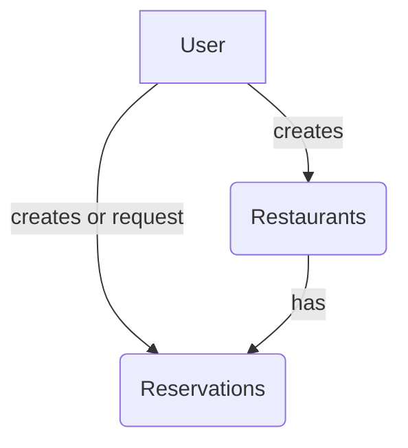

# Restaurant Reservation System

This project is a restaurant reservation system that allows administrators to efficiently manage reservations in real-time.

## Features

- **Reservation Management**: Administrators can create, delete, accept, or reject reservation requests.
- **Report View**: View reservation statistics by day, week, and month.
- **Real-Time Reservations**: Reservations are updated in real-time using sockets.io.

## Technologies Used

- **Nuxt 3**: Vue.js framework for building web applications.
- **TailwindCSS**: CSS framework for designing user interfaces.
- **MongoDB**: NoSQL database for data storage.
- **Sockets.io**: Used to handle real time communication between client and server.

#### Domain Model Diagram



## Install

1. Clone the repository:
   ```bash
   git clone https://github.com/tu-usuario/reservations-app.git
   ```
2. Go to root:
   ```bash
   cd reservations-app
   ```
3. Install dependencies:
   ```bash
   npm install
   ```

## Usage

1. Start development server:
   ```bash
   npm run dev
   ```
2. Open the browser and go to `http://localhost:3000` in order to see the app.

## License

This project is licensed under the MIT License. See the `LICENSE` file for more details.

## Author

This project is maintained by Gualberto Cuiza. Feel free to reach out if you have any questions or suggestions.
